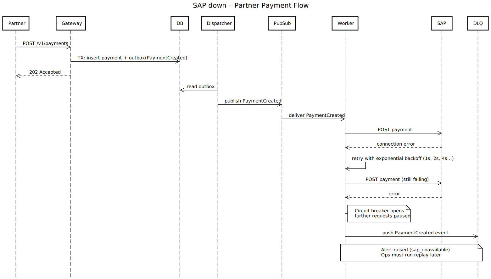

# Partner Payments Bridge

## Goal

Design a resilient architecture that **decouples multiple B2B partners from SAP**. The system must guarantee:
- **Durability** (no data loss)
- **Prevention of duplicates**
- **Reliable acknowledgements** to partners even if SAP is slow or down

## Why

- Partners need **fast feedback** even if SAP is overloaded or down.
- Avoid external exposure to SAP (**security & performance**).
- **Resilience, Observability, and Security** are key factors.

## Intended Scope

- **Architecture Design:**  
    Gateway, DB, Dispatcher, Message Queue / PubSub, SAP Mock, Webhooks Service, Partner Configuration Service, Worker / SAP Adapter
- **Reliability:**  
    Retries with exponential backoff, Dead Letter Queues, Outbox, Idempotency
- **Security:**  
    OAuth2, Signed Webhooks, minimal PII
- **Observability:**  
    Logs, Software Metrics, etc.

## Key Scenarios

### 1. Happy Path

---

### 2. SAP Slow / Overloaded

---

### 3. SAP Down

---

## 🔑 Mapping Project Components → AWS Services P.S. Still figuring things out (learning about AWS / GCP)

### 1. Partner Gateway

**Task:** Public API → Auth, Validation, Idempotency, Fast Ack.

**AWS Service:**
- API Gateway (entry gate, auth, rate limits, API keys)
- ECS Fargate or Lambda (for the actual microservice code)

**Alternative:**  
If REST is stable, ECS Fargate (container); if small, fast functions, Lambda.

---

### 2. Payments Core (DB + Outbox)

**Task:** Relational database with ACID transactions (Payments + Outbox).

**AWS Service:**
- RDS (e.g., PostgreSQL or MySQL)  
  → good for relational data + Outbox pattern.

**Alternative:**  
DynamoDB would be too unstructured, so RDS is the best fit.

---

### 3. Dispatcher

**Task:** Reads Outbox, publishes events to the queue.

**AWS Service:**
- Lambda (triggered via RDS CDC or polling)
- ECS Fargate (container job that polls the Outbox)  
  → publishes events to SQS or SNS.

**Alternative:**  
AWS DMS/CDC Streams (Change Data Capture), but Outbox + Polling Worker is sufficient for your project.

---

### 4. Queue / PubSub

**Task:** Decoupling, asynchronous events, retry/DLQ.

**AWS Service:**
- SQS (Message Queue, FIFO if order is important)
- DLQ integrated

**If you need broadcast/multiple subscribers:**  
SNS + SQS Subscriptions.

**Best fit for your project:**  
SQS FIFO (due to avoid duplicates + order).

---

### 5. Worker / SAP Adapter

**Task:** Consumes queue, calls SAP (mock), dedupe, retries, backoff.

**AWS Service:**
- ECS Fargate (persistent consumer, more control over retry logic)
- Lambda (SQS event trigger, auto-scaling)

**Best Fit:**  
Lambda → trigger directly with SQS, auto-scaling.

---

### 6. Webhooks Service

**Task:** Sends status updates to partners (signed, own retry loop).

**AWS Service:**
- ECS Fargate (container service because of outbound HTTP calls + own retry strategy)
- Lambda (triggered by SQS event "PaymentSettled")

**Best Fit:**  
Lambda + SQS trigger, unless you need very complex retry mechanics.

---

### 7. Partner Config Service

**Task:** Maintains partner-specific data: auth, mapping, webhook URLs.

**AWS Service:**
- DynamoDB (key-value store for partner configs → super fast, flexible JSONB)
- RDS (tables in Payments Core DB if you want to keep it relational)

**Best Fit:**  
DynamoDB, because configs tend to be key-value style.
